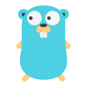

<div id="top"></div>


<!-- PROJECT LOGO -->
<br />
<div align="center">
    

  <h3 align="center">Golang with Redis,Docker and Mongo</h3>

  <p align="center">Quick api to test and discover how redis works. For best portability i added docker.</p>
</div>

 <br />  

<!-- TABLE OF CONTENTS -->
<details>
  <summary>Table of Contents</summary>
  <ol>
    <li>
      <a href="#about-the-project">🧭 About The Project</a>
      <ul>
        <li><a href="#built-with">🏗️ Built With</a></li>
      </ul>
    </li>
    <li>
      <a href="#getting-started">📋 Getting Started</a>
      <ul>
        <li><a href="#prerequisites">🗺️ Prerequisites</a></li>
        <li><a href="#installation">⚙️ Installation</a></li>
      </ul>
    </li>
    <li><a href="#usage">💾 Usage</a></li>
    <li><a href="#contributing">🔗 Contributing</a></li>
    <li><a href="#license">📰 License</a></li>
    <li><a href="#contact">📫 Contact</a></li>
    <li><a href="#acknowledgments">⛱️ Acknowledgments</a></li>
  </ol>
</details>

<br>


<!-- ABOUT THE PROJECT -->
## 🧭 About The Project

### 🏗️ Built With

List of technologies / frameworks used during the project.

* [](https://go.dev/)
* [](https://redis.io/)
* [](https://www.mongodb.com/)
* 🐋 Docker

<p align="right"><a href="#top">⬆️</a></p>


<!-- GETTING STARTED -->
## 📋 Getting Started

To get a local copy up and running follow these simple example steps.

### 🗺️ Prerequisites

If you run project directly with docker-compose skip these steps

* Golang compiler under version 1.18 should work.
* Redis 3.16
* Mongo 5.0.8
* Docker
* Docker-compose

Also you need to create **.env** at the root folder project :
```bash
PWD_REDIS=password_redis

ID_MONGO=api_user
PWD_MONGO=password_mongo
DB_MONGO=api_prod_db

ROOT_MONGO=root
ROOT_PWD_MONGO=password
```

<p align="right"><a href="#top">⬆️</a></p>


<!-- USAGE EXAMPLES -->
## 💾 Usage

To build api :

```bash
$bash : chmod +x build.sh
$bash : ./build.sh #That script will create dist folder
```

To run api

```bash
$bash : ./dist/api-golang port
```

To check request

```bash
$bash : curl http://locahost:port/redis
$bash : curl http://locahost:port/notredis
```

Run with docker-compose
```bash
$bash : docker-compose up --build -d
$bash : docker ps container # Check containers running
```

<p align="right"><a href="#top">⬆️</a></p>


<!-- CONTRIBUTING -->
## 🔗 Contributing

Contributions are what make the open source community such an amazing place to learn, inspire, and create. Any contributions you make are **greatly appreciated**.

If you have a suggestion that would make this better, please fork the repo and create a pull request. You can also simply open an issue with the tag "enhancement".
Don't forget to give the project a star! Thanks again!

1. Fork the Project
2. Create your Feature Branch (`git checkout -b feature/AmazingFeature`)
3. Commit your Changes (`git commit -m 'Add some AmazingFeature'`)
4. Push to the Branch (`git push origin feature/AmazingFeature`)
5. Open a Pull Request

<p align="right"><a href="#top">⬆️</a></p>


<!-- LICENSE -->
## 📰 License

Distributed under the MIT License. See `LICENSE.txt` for more information.

<p align="right"><a href="#top">⬆️</a></p>


<!-- CONTACT -->
## 📫 Contact

Reach me at : gauron.dorian.pro@gmail.com.

Project Link: [https://github.com/Michelprogram/blind-test.git](https://github.com/Michelprogram/blind-test.git)

<p align="right"><a href="#top">⬆️</a></p>


<!-- ACKNOWLEDGMENTS -->
## ⛱️ Acknowledgments

This space is a list to resources i found helpful and would like to give credit to.

* [Docker compose](https://docs.docker.com/compose/)
* [Mongo driver for go](https://www.mongodb.com/docs/drivers/go/current/)
* [Redis for go](https://redis.uptrace.dev/)

<p align="right"><a href="#top">⬆️</a></p>

<a href="https://github.com/othneildrew/Best-README-Template">Template inspired by othneildrew</a>